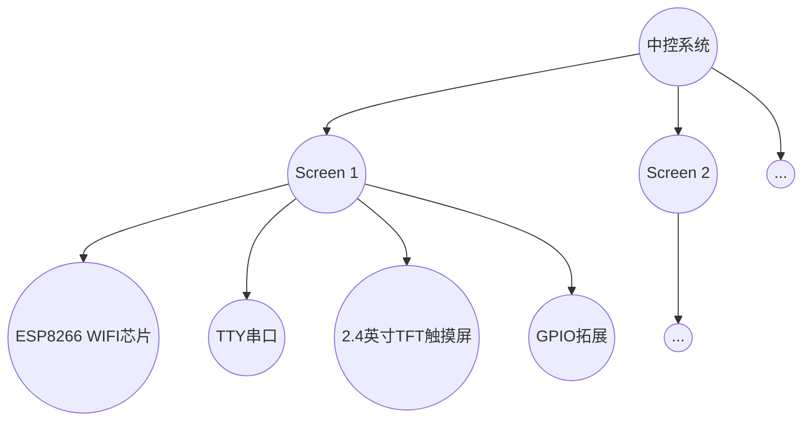
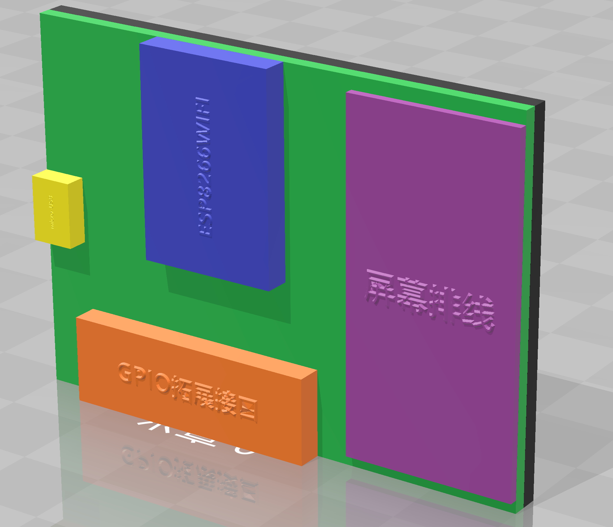
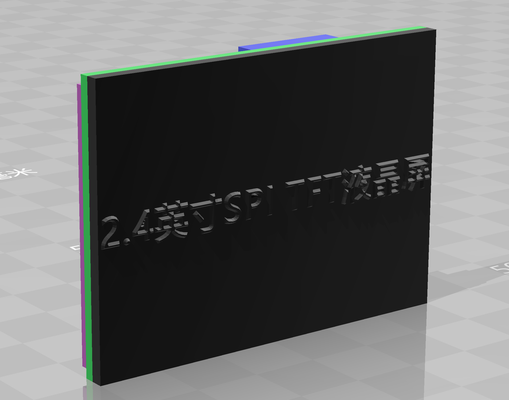
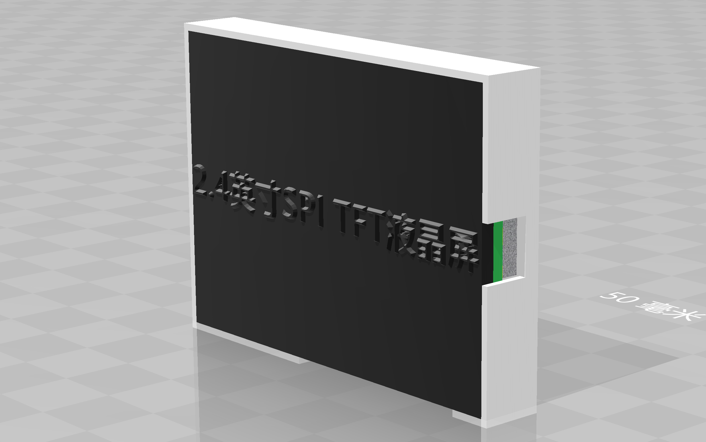
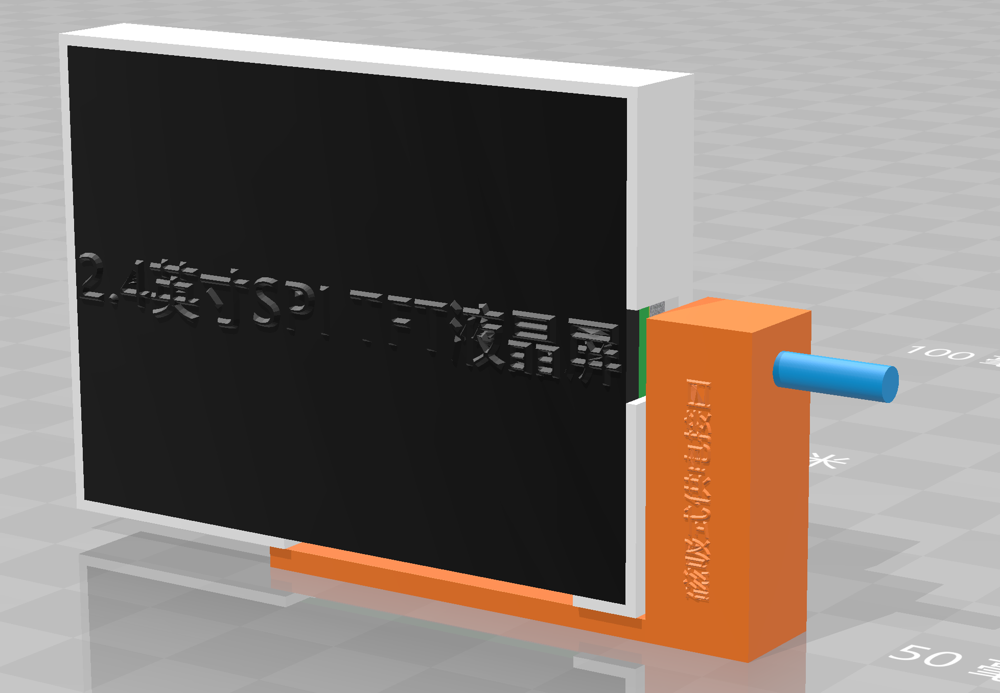
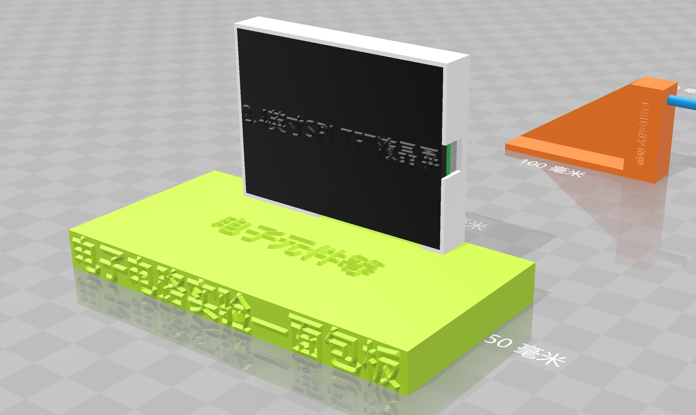

# IoScreens

Internet of Screens. Build a network for small screens everywhere in a lab or an office.

## 系统动机

显示屏作为最重要的信息与人机交互载体，比如手机、电脑、智能手表等设备，给我们的生活带来了极大的便利。如果将显示屏变为随处可用的设备，又能进一步增强其交互性，为工作和生活提供便利。

本项目的设计有以下特点：

- 成本不足100元的超薄显示设备（不含电池）
- 使用**磁吸式**接口，方便用户移动显示屏设备
- 中控服务器开启若干VNC server，供client接入，可以显示网页内容，方便开发人员编程和快速开发与部署
- 提供若干GPIO接口，可以进行单片机开发，提供图形化界面demo
- 开发一个有图形界面的系统即占体积，又开发困难；我们可以让图形界面变得“即插即用”，磁吸式接口体积较小，同时让用户随意地将Screen吸上，就可以进行操作，较完整的显示屏有趣而高效
- 所有的Screen设备相同，当一个新版本的图形界面被开发出来，不需要烧录即可实时更新
- Web技术可以让用户用JavaScript开发单片机程序（此项目提供若干JavaScript API，比如ADC读取、GPIO操控、UART数据传输等）

## 系统框图

每一片Screen搭载WIFI芯片ESP8266，能够在802.11n上与中控主机进行高速的WIFI连接，并提供VNC解码输出到显示屏幕，同时获取用户的手指点击并发送至主机。

搭配3D打印外壳，总体厚度大约8mm，与一台iPhoneX的厚度相当（此部分不含电池）

在展柜或书桌上放置固定的底座，Screen放在上面时自动磁吸至充电座上并开始供电（也可进行固件更新）

同时，做实验的时候经常会用到单片机来测试芯片功能，将Screen插接到面包板上，就可以图形化控制GPIO，比如进行ADC采样读取、PWM波形输出、UART串口读写等功能

## References

https://github.com/Links2004/arduinoVNC 在ESP8266上开启VNC client

高雷斯磁吸数据线（天猫销售）

